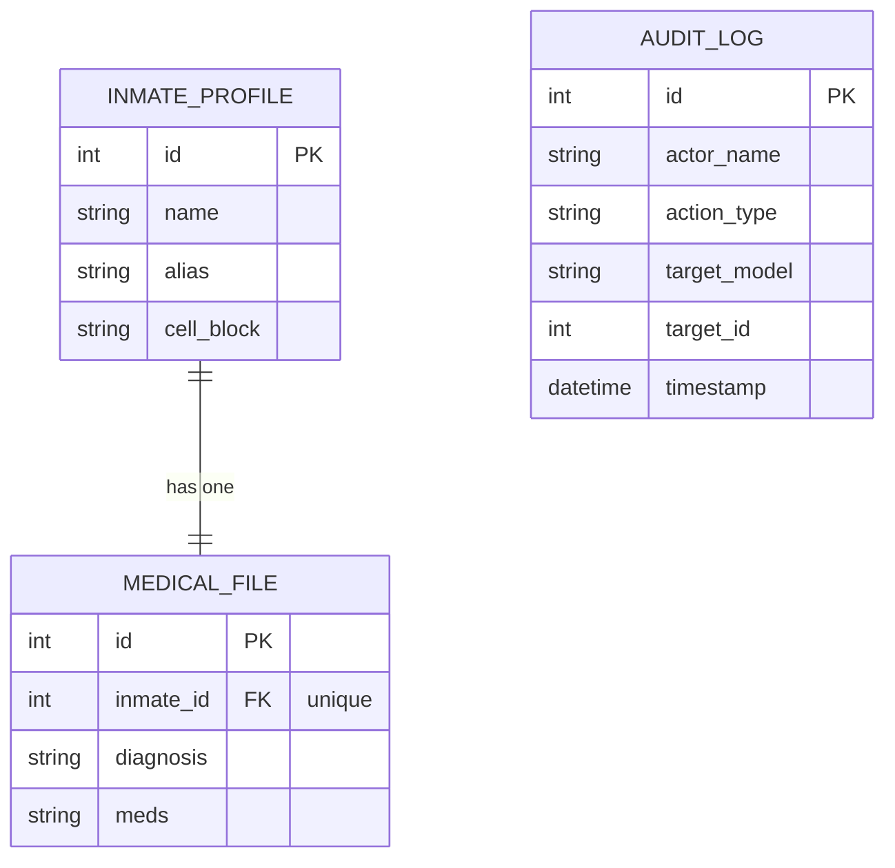

<p align="center">
  
  
  
  
</p>

<h1 align="center">🦇 Test Backend - Inmate Management System</h1>

<p align="center">
  <em>A secure, auditable backend API for managing Gotham's most dangerous inmates.</em>
</p>

<p align="center">
  Built with DRF · JWT Auth · RBAC · Immutable Audit Logging
</p>

<br>

## 📖 The Story

After a series of high-profile breakouts and internal scandals, the **Gotham City Council** forces Warden Quincy Sharp to modernize Arkham's inmate systems with a secure, auditable backend service — replacing paper files and ad-hoc spreadsheets.

This project models a minimal but realistic slice of that system. The goal is to **track inmates**, their public-facing details (name, aliases, cell block) and tightly controlled **medical records**, while recording every sensitive action in an **immutable audit log**.

> _One missing prescription for Jonathan Crane or a misrouted transfer for Harvey Dent can mean another headline-making disaster._

<br>

## 🏢 Project Overview
The system is complemented by high-fidelity visualizers. **Note:** Since GitHub does not render HTML files directly, please download these files and open them in your local browser for the full interactive experience...

*   [**Solution Architecture**](./solution_architecture.html) — High level business flow and user roles.
*   [**Technical Architecture**](./technical_architecture.html) — Deep dive into request lifecycle, middlewares, and API routing.
*   [**Database ER Model**](./database_er_model.html) — Entity Relationship diagram and field level data dictionary.

<br>

## 👥 User Roles & Permissions

| Role | Character | Access Level |
|------|-----------|-------------|
| **Super Admin** | Warden (Quincy Sharp) | Full CRUD on all models |
| **Medical Staff** | Dr. Leland | Read/Update medical records |
| **Security Staff** | Guard Boles | View inmates, transfer cell blocks (via custom `IsSecurityStaff` permission) |
| **Public Visitor** | General Public | View non-sensitive inmate info only (read-only) |

<br>

## 🛡️ Security Features

### Authentication
- **JWT tokens** via [SimpleJWT](https://django-rest-framework-simplejwt.readthedocs.io/) + [Djoser](https://djoser.readthedocs.io/)
- Access token lifetime: **45 minutes**
- Refresh token lifetime: **4 days**

### Rate Limiting (Throttling)

| Scope | Rate | Applied To |
|-------|------|-----------|
| Anonymous users | `5/min` | All endpoints (global) |
| Authenticated users | `100/min` | All endpoints (global) |
| Inmate Transfer | `10/min` | `POST /inmates/{id}/transfer` |
| Medical Records | `20/min` | All medical record endpoints |
| Audit Logs | `50/min` | All audit log endpoints |

### Role-Based Access Control
- **`StrictDjangoModelPermissions`** — Enforces Django's model-level permissions, including `GET` (read), which DRF skips by default.
- **`IsSecurityStaff`** — Custom permission for guarding the inmate transfer action.

<br>

## 📊 Database Schema



<br>

## 🔌 API Endpoints

Base URL: `http://127.0.0.1:8000/api/v1/`

### Authentication (Djoser + JWT)
| Method | Endpoint | Description |
|--------|----------|-------------|
| `POST` | `/api/auth/jwt/create` | Obtain JWT token pair |
| `POST` | `/api/auth/jwt/refresh` | Refresh access token |
| `POST` | `/api/auth/users/` | Register a new user |
| `GET` | `/api/auth/users/me/` | View current authenticated user's info |

<br>

### Inmate Management
| Method | Endpoint | Description |
|--------|----------|-------------|
| `GET` | `/api/v1/default-router/inmates` | List all inmates |
| `GET` | `/api/v1/default-router/inmates/{id}` | Retrieve inmate details |
| `POST` | `/api/v1/default-router/inmates` | Create inmate profile |
| `PUT` | `/api/v1/default-router/inmates/{id}` | Update inmate profile |
| `DELETE` | `/api/v1/default-router/inmates/{id}` | Delete inmate profile |
| `POST` | `/api/v1/default-router/inmates/{id}/transfer` | Transfer inmate cell block |

<br>

### Medical Records
| Method | Endpoint | Description |
|--------|----------|-------------|
| `GET` | `/api/v1/default-router/medical-records` | List all medical records |
| `GET` | `/api/v1/default-router/medical-records/{id}` | Retrieve medical record |
| `POST` | `/api/v1/default-router/medical-records` | Create medical record |
| `PUT` | `/api/v1/default-router/medical-records/{id}` | Update medical record |
| `DELETE` | `/api/v1/default-router/medical-records/{id}` | Delete medical record |

<br>

### Audit & Watchtower
| Method | Endpoint | Description |
|--------|----------|-------------|
| `GET` | `/api/v1/default-router/security-logs` | List all audit logs |
| `GET` | `/api/v1/default-router/security-logs/{id}` | Retrieve audit log entry |

<br>

## 🔍 Audit Logging

The system **automatically records** every significant action:

| Trigger | Actions Logged | Mechanism |
|---------|---------------|-----------|
| Create/Update/Delete on `InmateProfile` or `MedicalFile` | `CREATE`, `UPDATE`, `DELETE` | Django Signals (`signals.py`) |
| Read on `InmateProfile` or `MedicalFile` | `READ` | Decorator (`@audit_read` in `decorators.py`) |

Each log entry captures: **who** did it (`actor_name`), **what** they did (`action_type`), **which record** (`target_model` + `target_id`), and **when** (`timestamp`).

<br>

## 🏁 Getting Started

### Prerequisites
- Python 3.12+
- MySQL 8.0+
- Pipenv
- pip (Python package manager)
- Git
- A REST client like Postman or Insomnia (for testing API endpoints)
- MySQL Workbench or any MySQL GUI client (optional, for inspecting the database)

### Installation

```bash
# Clone the repository
git clone https://github.com/<your-username>/arkham-asylum-backend.git
cd arkham-asylum-backend

# Install dependencies
pipenv install

# Configure MySQL database
# Create a MySQL database named 'arkham_registry'
# Then update arkham_pm/settings.py with your MySQL credentials (USER, PASSWORD, HOST, PORT)

# Run migrations
pipenv run python manage.py migrate

# Create a superuser (Warden)
pipenv run python manage.py createsuperuser

# Start the development server
pipenv run python manage.py runserver
```

### Setting Up Roles

> **Important:** User groups, permissions, and role assignments are stored in the **database**, not in the codebase. They do **not** ship with the GitHub repo. You must configure them manually after running migrations.

1. Log into the Django Admin panel at `http://127.0.0.1:8000/admin/`
2. Navigate to **Groups** and create the following 4 groups:
   - `Super Admin`
   - `Medical Staff`
   - `Security Staff`
   - `Public Visitor`
3. Assign the appropriate **model permissions** to each group:
   - **Super Admin** — All permissions on `InmateProfile`, `MedicalFile`, and `AuditLog`
   - **Medical Staff** — View + Change permissions on `MedicalFile`; View on `InmateProfile`
   - **Security Staff** — View + Change permissions on `InmateProfile` (cell block transfers are handled by the custom `IsSecurityStaff` permission in code)
   - **Public Visitor** — View permission on `InmateProfile` only
4. Create users via the admin panel and assign them to the relevant group(s). Refer to `arkham_app/creds.md` for sample usernames, passwords, and their group assignments

<br>

## ⚙️ Tech Stack

| Layer | Technology |
|-------|-----------|
| **Framework** | Django 6.0 + Django REST Framework |
| **Authentication** | SimpleJWT + Djoser |
| **Database** | MySQL 8.0 |
| **Rate Limiting** | DRF Throttling (LocMemCache) |
| **CORS** | django-cors-headers |
| **AI Assistance** | AntiGravity (Google AI Pro) + Perplexity Pro + OpenClaw |

<br>

## 📌 Scope

### In Scope
- ✅ Centralized JWT authentication for all API access
- ✅ Secure REST APIs for inmate profiles and medical files
- ✅ Role-based permissions (Warden, Medical Staff, Guards, Visitors)
- ✅ Persistent audit logging of all security-relevant actions
- ✅ Rate limiting to prevent brute-force and abuse

### Out of Scope
- ❌ Public user self-registration and password-reset flows
- ❌ CRUD APIs for managing roles/groups
- ❌ Production-grade frontend or multi-tenant architecture
- ❌ Multi-environment deployment automation

<br>

<p align="center">
  <strong>🦇 "It's not who I am underneath, but what I do that defines me." 🦇</strong>
</p>

<p align="center">
  <em>Built as a learning project to explore Django REST Framework security patterns.</em>
</p>
